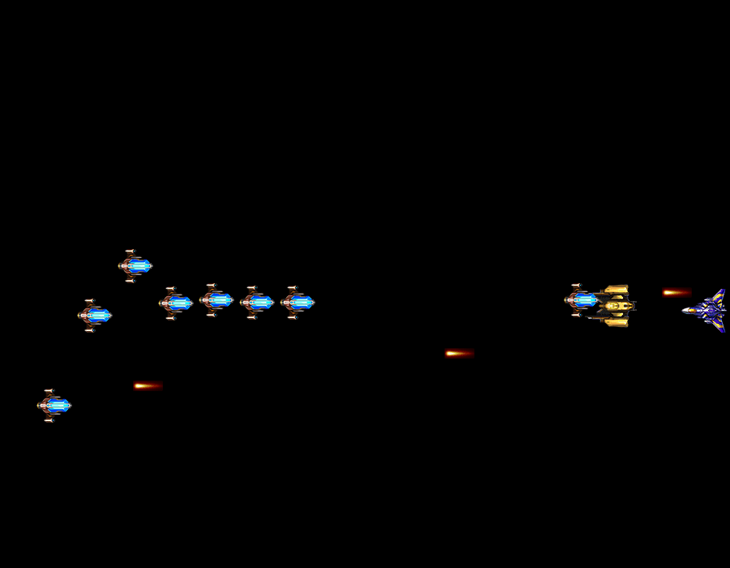

# Raiden AI

## Version 0

We implemented our own DQN algorithm to train the raiden game for about 40,000 iterations.


The following advantages are observed:
- Plane knows how to avoid the enemies to some extent

The following issues are observed:
- Training is slow
- Plane keeps crashing the enemies after running for 5 seconds
- Plane gets stuck on the edge and does not have the motivation to shoot the enemies

The following improvements are made based on the observations:
- Adjust the hp of enemies so that they can be cleared after one shot
- Adjust the random actions probabilities so that the plane is more possible to explore around
- Speed up the game

## Version 1
We adjust the settings of the game and parameters of our algorithms. We train the new model for about 100,000 iterations.


The following advantages are observed:
- Plane shoots part of the enemies
- Game is running faster
- Plane has more freedom to explore

The following issues are observed:
- Plane still keeps crashing enemies 

The reason of crashing is possibly that the original reward function of DQN does not count the crashing immediatly, instead, it only reacts when one life is lost. Moreover, referenced by the reward function in Flappy bird, we shall give small reward for each time the plane survives. In such a case, reward will not stay the same number for a long time, which may result a difficulty in training.

The following improvements are made based on the observations:
- Adjust the reward function based on the previous content

## Version 2
We adjust the reward function and train the new model for about 100,000 iterations.


The following advantages are observed:
- Plane can almost clear all the Type I enemies without getting any harm

The following issues are observed:
- Plane cannot deal with the suicide type enemies

We find that the suicide type enemies are more difficult to deal with than other types. As a result, we adjust the order of the enemies so that they comes in the order from the easiest to the most difficult one.




## Technical issue
1. Baseline integration

2. Cloud server video service
    When we train our model in cloud services, the following errors will come
    ```sh
    pygame.error: No available video device
    ```
    Set the video device to "dummy" will cause the loss function to be NAN, which     raises a problem in training. 
    We solved the method by setting VNC port in Google cloud and run our         algorithms via a VNC client server connected to the cloud service.
## Future Work

- Improve the DQN. Change the settings of the game so that the enemies will appear in a random initail point instead of a fixed point now. Moreover we could add noise on the movements of enemies to see if DQN could be stable and perform well.
- Implement A3C and PPO